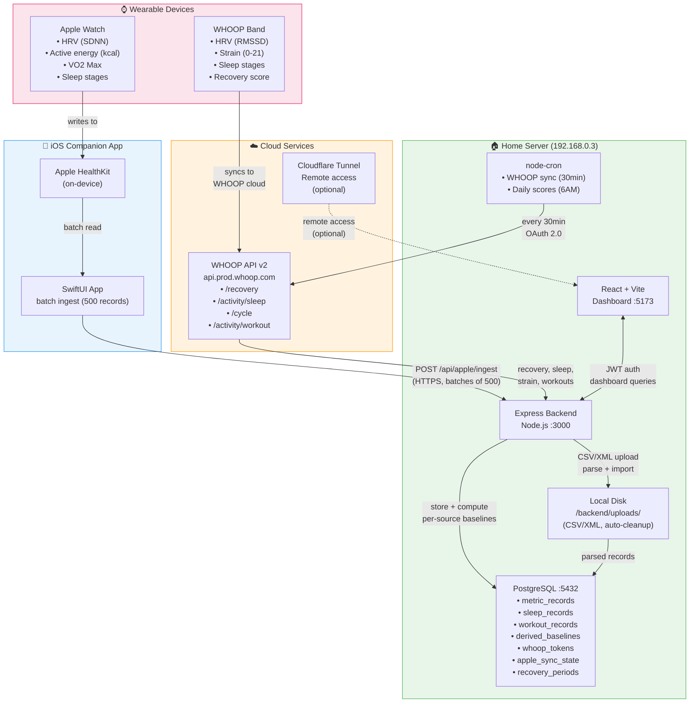

# HealthStitch — Data Flow Architecture

> Multi-device health data aggregator stitching WHOOP and Apple Watch metrics with per-source baselines.

## Platform Summary

| Layer | Service |
|-------|---------|
| **Backend Hosting** | Home server (Node.js + Express, `192.168.0.3`) |
| **Frontend Hosting** | Home server (React + Vite, `localhost:5173`) |
| **Remote Access** | Cloudflare Tunnel (`*.trycloudflare.com`) |
| **Database** | PostgreSQL (local, `192.168.0.3:5432`, db: `sleepdata`) |
| **Auth** | JWT (bcryptjs, 7-day expiry) |
| **Wearable APIs** | WHOOP REST API v2 (OAuth 2.0) |
| **Mobile Companion** | iOS SwiftUI app → Apple HealthKit |
| **File Uploads** | Local disk (`/backend/uploads/`, auto-cleanup) |
| **Background Jobs** | node-cron (WHOOP sync every 30min, daily scores at 6AM UTC) |
| **Cloud Storage** | None (all local) |
| **Analytics** | None |

## Data Flow



## Key Data Flows

1. **WHOOP Sync**: WHOOP band → WHOOP Cloud → cron (30min) → OAuth API → PostgreSQL (per-source HRV baseline)
2. **Apple Watch Sync**: Apple Watch → HealthKit → iOS app → `POST /api/apple/ingest` → PostgreSQL (per-source HRV baseline)
3. **File Import**: User uploads WHOOP CSV or Apple Health XML → parsed → PostgreSQL
4. **Dashboard**: React frontend → JWT auth → Express API → PostgreSQL queries + derived baselines
5. **Remote Access**: Cloudflare Tunnel exposes dashboard externally (optional)

## Per-Source Baseline Logic

WHOOP RMSSD and Apple SDNN are **different statistical methods** — each device's HRV is compared only against its own 90-day rolling baseline. Morning check-in nests by source:

```json
{
  "hrv": {
    "whoop": { "value": 45, "metric_type": "hrv_rmssd", "baseline_90d": 42, "delta_pct": 7.1 },
    "apple_watch": { "value": 62, "metric_type": "hrv_sdnn", "baseline_90d": 58, "delta_pct": 6.9 }
  }
}
```
